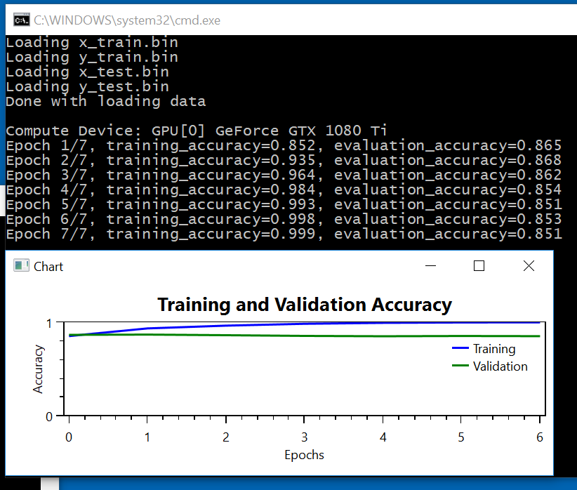

# IMDB Example

The original Python code can be found in [ch3-5.py](../../Python/ch3-5.py)

We'll need to do 4 things:

1. Load the IMDB data
2. Create the Network
3. Train the Network
4. Plot the Training/Evaluation Accuracy

### Loading the Data
The code to load the IMDB data is very similar to what we used for the MNIST data set
```
void load_data() {
  if (!System.IO.File.Exists("x_train.bin")) {
    System.IO.Compression.ZipFile.ExtractToDirectory("imdb_data.zip", ".");
  }
  x_train = Util.load_binary_file("x_train.bin", 25000, 10000);
  y_train = Util.load_binary_file("y_train.bin", 25000);
  x_test = Util.load_binary_file("x_test.bin", 25000, 10000);
  y_test = Util.load_binary_file("y_test.bin", 25000);

  Console.WriteLine("Done with loading data\n");
}

```

### Creating the Network in C#

The Keras code that creates the network is:
```
model = keras.models.Sequential()
model.add(keras.layers.Dense(16, activation='relu', input_shape=(10000,)))
model.add(keras.layers.Dense(16, activation='relu'))
model.add(keras.layers.Dense(1, activation='sigmoid'))

model.compile(optimizer='rmsprop', loss='binary_crossentropy', metrics=['accuracy'])
model.compile(optimizer=keras.optimizers.RMSprop(lr=0.001), loss='binary_crossentropy', metrics=['accuracy'])
```

In C#, the code looks like: 
```
void create_network() {
  computeDevice = Util.get_compute_device();
  Console.WriteLine("Compute Device: " + computeDevice.AsString());

  x_tensor = CNTK.Variable.InputVariable(CNTK.NDShape.CreateNDShape(new int[] { 10000 }), CNTK.DataType.Float);
  y_tensor = CNTK.Variable.InputVariable(CNTK.NDShape.CreateNDShape(new int[] { 1 }), CNTK.DataType.Float);

  network = CNTK.CNTKLib.ReLU(Util.Dense(x_tensor, 16, computeDevice));
  network = CNTK.CNTKLib.ReLU(Util.Dense(network, 16, computeDevice));
  network = CNTK.CNTKLib.Sigmoid(Util.Dense(network, 1, computeDevice));

  loss_function = CNTK.CNTKLib.BinaryCrossEntropy(network.Output, y_tensor);
  accuracy_function = Util.BinaryAccuracy(network.Output, y_tensor);

  var parameterVector = new CNTK.ParameterVector((System.Collections.ICollection)network.Parameters());
  var learner = CNTK.CNTKLib.AdamLearner(parameterVector, new CNTK.TrainingParameterScheduleDouble(0.001, 1), new CNTK.TrainingParameterScheduleDouble(0.9, 1), true);
  trainer = CNTK.CNTKLib.CreateTrainer(network, loss_function, accuracy_function, new CNTK.LearnerVector() { learner });
  evaluator = CNTK.CNTKLib.CreateEvaluator(accuracy_function);
}
```

Note that since this is a binary classification problem, we have defined a custom `accuracy_function`  
```
static public CNTK.Function BinaryAccuracy(CNTK.Variable prediction, CNTK.Variable labels) {
  var round_predictions = CNTK.CNTKLib.Round(prediction);
  var equal_elements = CNTK.CNTKLib.Equal(round_predictions, labels);
  var result = CNTK.CNTKLib.ReduceMean(equal_elements, new CNTK.Axis(0));
  return result;
}
```

### Training / Validation Set

In Keras, the split in training/validation sets is done as follows
```
# step 3: train network
x_val = x_train[:10000]
partial_x_train = x_train[10000:]
y_val = y_train[:10000]
partial_y_train = y_train[10000:]
history = model.fit(partial_x_train, partial_y_train, epochs=4, batch_size=512, validation_data=(x_val, y_val))
```

In C#, we need to write two separate loops for the training and evaluation phase. 

The training phase uses a `CNKT.Trainer`
```
double train_phase() {
  var train_indices = Util.shuffled_indices(x_train.Length - offset);
  var pos = 0;
  var num_batches = 0;
  var epoch_training_accuracy = 0.0;
  while (pos < train_indices.Length) {
    var pos_end = Math.Min(pos + batch_size, train_indices.Length);
    var minibatch_x = Util.get_tensors(x_tensor.Shape, x_train, train_indices, pos, pos_end, computeDevice);
    var minibatch_y = Util.get_tensors(y_tensor.Shape, y_train, train_indices, pos, pos_end, computeDevice);
    var feed_dictionary = new feed_t() { { x_tensor, minibatch_x }, { y_tensor, minibatch_y } };
    trainer.TrainMinibatch(feed_dictionary, true, computeDevice);
    var minibatch_accuracy = trainer.PreviousMinibatchEvaluationAverage();
    epoch_training_accuracy += minibatch_accuracy;
    pos = pos_end;
    num_batches++;
  }
  epoch_training_accuracy /= num_batches;
  return epoch_training_accuracy;
}
```

The evaluation phase uses a `CNTK.Evaluator`
```
double evaluation_phase() {
  var pos = offset;
  var num_batches = 0;
  var epoch_evaluation_accuracy = 0.0;
  while (pos < x_test.Length) {
    var pos_end = Math.Min(pos + batch_size, x_train.Length);
    var minibatch_x = Util.get_tensors(x_tensor.Shape, x_test, pos, pos_end, computeDevice);
    var minibatch_y = Util.get_tensors(y_tensor.Shape, y_test, pos, pos_end, computeDevice);
    var feed_dictionary = new test_feed_t() { { x_tensor, minibatch_x }, { y_tensor, minibatch_y } };
    var minibatch_accuracy = evaluator.TestMinibatch(feed_dictionary, computeDevice);
    epoch_evaluation_accuracy += minibatch_accuracy;
    num_batches++;
    pos = pos_end;
  }
  epoch_evaluation_accuracy /= num_batches;
  return epoch_evaluation_accuracy;
}
```

### Plotting the Training / Evaluation Accuracy

The Python code uses the very popular Matplotlib library

```
plt.plot(epochs, acc, 'bo', label='Training acc')
plt.plot(epochs, val_acc, 'b', label='Validation acc')
plt.title('Training and validation accuracy')
plt.xlabel('Epochs')
plt.ylabel('Loss')
plt.legend()
plt.show()
```

In C#, we'll fire up a WPF window, that contains an OxyPlot control. 
```
class PlotWindow : System.Windows.Window {
  public PlotWindow(List<List<double>> results) {
    var plotModel = new OxyPlot.PlotModel();
    plotModel.Title = "Training and Validation Accuracy";
    plotModel.Axes.Add(new OxyPlot.Axes.LinearAxis() { Position = OxyPlot.Axes.AxisPosition.Left, Title = "Accuracy" });
    plotModel.Axes.Add(new OxyPlot.Axes.LinearAxis() { Position = OxyPlot.Axes.AxisPosition.Bottom, Title = "Epochs" });
    var labels = new string[] { "Training", "Validation" };
    var colors = new OxyPlot.OxyColor[] { OxyPlot.OxyColors.Blue, OxyPlot.OxyColors.Green };
    for (int row = 0; row < results.Count; row++) {
      var lineSeries = new OxyPlot.Series.LineSeries();
      lineSeries.ItemsSource = results[row].Select((value, index) => new OxyPlot.DataPoint(index, value));
      lineSeries.Title = labels[row];
      lineSeries.Color = colors[row];
      plotModel.Series.Add(lineSeries);
    }
    var plotView = new OxyPlot.Wpf.PlotView();
    plotView.Model = plotModel;
    Title = "Chart";
    Content = plotView;
  }
}
```

It looks like this

