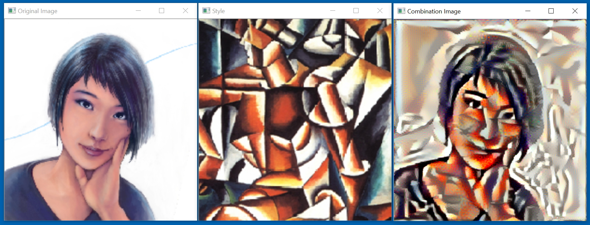
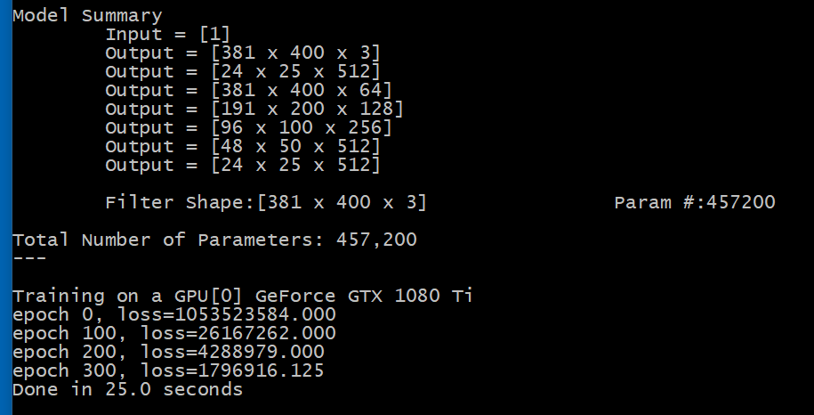

# Neural Style Transfer



The original Python code can be found in [ch8-3.py](../../Python/ch8-3.py)

At first sight, Neural Style Transfer seems a different task that 
what we have had to deal with so far. But, after some refactoring, we can
transform it to the familiar form with the following steps:

1. Define a neural network, and gather the training data.
2. Train the network for a number of epochs.
3. Do inference, and show the results.

This is done in the function `style_transfer`
```
void style_transfer() {
  CNTK.Function model = null;
  float[][] labels = null;
  create_model(ref model, ref labels);
  train(model, labels);
  var img_data = inference(model, labels);
  display_images(img_data);
}
```

Let's go step-by-step. 

## Preprocessing

The input data are two images: the original image, and the style
image. We'll read them in two `float[]` arrays using the functions
`preprocess_image` and `convert_to_channel_first` that make use
of OpenCV. 

```
static float[] convert_to_channel_first(Mat mat, float[] offsets) {
  var num_pixels = mat.Size().Height * mat.Size().Width;
  float[] result = new float[num_pixels * 3];
  MatOfByte3 mat3 = new MatOfByte3(mat);
  var indexer = mat3.GetIndexer();
  var pos = 0;
  for (int y = 0; y < mat.Height; y++) {
    for (int x = 0; x < mat.Width; x++) {
      var color = indexer[y, x];
      result[pos] = color.Item0 - offsets[0];
      result[pos + num_pixels] = color.Item1 - offsets[1];
      result[pos + 2 * num_pixels] = color.Item2 - offsets[2];
      pos++;
    }
  }
  mat3.Dispose(); mat3 = null;
  return result;
}

static float[] preprocess_image(string image_path, int img_height, int img_width) {
  var mat = Cv2.ImRead(image_path);
  var mat2 = new Mat(img_height, img_width, mat.Type());
  Cv2.Resize(mat, mat2, new Size(img_width, img_height));
  var img = convert_to_channel_first(mat2, offsets);
  mat2.Dispose(); mat2 = null;
  mat.Dispose(); mat = null;      
  return img;
}
```

A minor (but crucial detail) is that in the preprocessing step we
need to subtract the per-channel mean, because we'll use 
a Caffe-converted VGG19 network. 


## Getting the activations of the intermediate layers

Starting from a pre-trained VGG19 network, we create a `content_and_styles_model`
that also outputs the activations of the layers
`"conv5_2", "conv1_1", "conv2_1", "conv3_1", "conv4_1", "conv5_1"`. 

This is done in the function `create_base_content_and_styles_model` that uses the
auxiliary method `traverse_content_and_styles_nodes`, as follows: 

```
List<CNTK.Variable> traverse_content_and_styles_nodes(CNTK.Function model) {
  var nodes = new List<CNTK.Variable>();
  var node_names = new string[] { "conv5_2", "conv1_1", "conv2_1", "conv3_1", "conv4_1", "conv5_1" };
  foreach (var node_name in node_names) {
    var node = model.FindByName(node_name);
    nodes.Add(node);
  }
  return nodes;
}

CNTK.Function create_base_content_and_styles_model(int img_height, int img_width) {
  var combination_image = CNTK.Variable.InputVariable(new int[] { img_width, img_height, 3 }, CNTK.DataType.Float);
  var model = VGG19.get_model(combination_image, computeDevice, freeze: true, include_top: false);
  var nodes = traverse_content_and_styles_nodes(model);
  var content_and_styles_model = CNTK.Function.Combine(nodes, "content_and_styles").Clone(CNTK.ParameterCloningMethod.Freeze);
  return content_and_styles_model;
}
```

## Labels

The "labels" for the training are the intemediate-layer activations in the
VGG19 model. So, to compute them, all we need to do is to pass the two images
through the multiple-output model that we created in the previous step. 
This is done in the method `compute_labels`

```
float[][] compute_labels(CNTK.Function model, float[] target_image, float[] style_reference_image) {
  var input_shape = model.Arguments[0].Shape.Dimensions.ToArray();
  System.Diagnostics.Debug.Assert(input_shape[0] * input_shape[1] * input_shape[2] == target_image.Length);
  System.Diagnostics.Debug.Assert(target_image.Length == style_reference_image.Length);

  var batch_buffer = new float[2 * target_image.Length];
  Array.Copy(target_image, 0, batch_buffer, 0, target_image.Length);
  Array.Copy(style_reference_image, 0, batch_buffer, target_image.Length, target_image.Length);
  var batch_nd = new CNTK.NDArrayView(new int[] { model.Arguments[0].Shape[0], model.Arguments[0].Shape[1], model.Arguments[0].Shape[2], 1, 2 }, batch_buffer, computeDevice);
  var batch = new CNTK.Value(batch_nd);

  var inputs = new Dictionary<CNTK.Variable, CNTK.Value>() { { model.Arguments[0], batch } };
  var outputs = new Dictionary<CNTK.Variable, CNTK.Value>();
  foreach (var output in model.Outputs) {
    outputs.Add(output, null);
  }
  model.Evaluate(inputs, outputs, computeDevice);

  float[][] labels = new float[model.Outputs.Count][];
  labels[0] = outputs[model.Outputs[0]].GetDenseData<float>(model.Outputs[0])[0].ToArray();
  for (int i = 1; i < labels.Length; i++) {
    labels[i] = outputs[model.Outputs[i]].GetDenseData<float>(model.Outputs[i])[1].ToArray();
  }

  return labels;
}
```

## Model Freeze

During training, we want only the inputs (i.e., the combination image) to be 
"learned" and modified. The rest of the network should be marked as non-trainable. This
is done in the bottom part of the function `create_model`

```
void create_model(ref CNTK.Function model, ref float[][] labels) {
  var target_image = preprocess_image(target_image_path, img_height, img_width);
  var style_reference_image = preprocess_image(style_reference_image_path, img_height, img_width);
  var base_model = create_base_content_and_styles_model(img_height, img_width);
  labels = compute_labels(base_model, target_image, style_reference_image);

  var dream_weights_init = new CNTK.NDArrayView(new int[] { img_width, img_height, 3 }, target_image, computeDevice);
  var dream_weights = new CNTK.Parameter(dream_weights_init, "the_dream");
  var dummy_features = CNTK.Variable.InputVariable(new int[] { 1 }, CNTK.DataType.Float, "dummy_features");
  var dream_layer = CNTK.CNTKLib.ElementTimes(dream_weights, dummy_features, "the_dream_layler");

  var replacements = new Dictionary<CNTK.Variable, CNTK.Variable>() { { base_model.Arguments[0], dream_layer.Output } };
  model = base_model.Clone(CNTK.ParameterCloningMethod.Freeze, replacements);

  var all_outputs = new List<CNTK.Variable>() { dream_layer };
  all_outputs.AddRange(model.Outputs);
  model = CNTK.Function.Combine(all_outputs, name: "overall_model");
}
```

## Loss Function: Content Loss, Style Loss

The loss function used by the `CNTK.Trainer` is computed in the method `create_loss_function`. 
It's the sum of the `content_loss`, and the `style_loss`. 

```
CNTK.Function create_loss_function(CNTK.Function model, IList<CNTK.Variable> outputs, IList<CNTK.Variable> labels) {
  var loss_function = content_loss(outputs[0], labels[0]);
  for (int i = 1; i < outputs.Count; i++) {
    var sl = style_loss(outputs[i], labels[i]);
    loss_function = CNTK.CNTKLib.Plus(loss_function, sl);
  }
  Util.summary(loss_function);
  Util.log_number_of_parameters(model);
  return loss_function;
}

CNTK.Function content_loss(CNTK.Variable x, CNTK.Function y) {
  var diff_ = CNTK.CNTKLib.Minus(x, y, name: "content_loss_diff_");
  var square_ = CNTK.CNTKLib.Square(diff_, name: "content_loss_square_");
  var sum_ = CNTK.CNTKLib.ReduceSum(square_, CNTK.Axis.AllStaticAxes(), name: "content_loss_sum_");      
  var scaling = CNTK.Constant.Scalar((float)(1.0/x.Shape.TotalSize), computeDevice);
  sum_ = CNTK.CNTKLib.ElementTimes(sum_, scaling, name: "content_loss_");
  return sum_;
}

CNTK.Function gram_matrix(CNTK.Variable x) {
  var x_shape = x.Shape.Dimensions.ToArray();
  var features = CNTK.CNTKLib.Reshape(x, new int[] { x_shape[0] * x_shape[1], x_shape[2] }, name: "gram_matrix_reshape_");
  var gram = CNTK.CNTKLib.TransposeTimes(features, features, name: "gram_matrix_transpose_times_");      
  return gram;
}

CNTK.Function style_loss(CNTK.Variable style, CNTK.Variable combination) {
  var style_gram = gram_matrix(style);
  var combination_gram = gram_matrix(combination);
  var diff_ = CNTK.CNTKLib.Minus(style_gram, combination_gram, name: "style_loss_diff_");
  var square_ = CNTK.CNTKLib.Square(diff_, name: "style_loss_square_");
  var sum_ = CNTK.CNTKLib.ReduceSum(square_, CNTK.Axis.AllStaticAxes(), name: "style_loss_reduce_sum_");
  var max_ = CNTK.CNTKLib.ReduceMax(style_gram, CNTK.Axis.AllStaticAxes(), name: "style_loss_reduce_max");
  var style_gram_total_size = style_gram.Output.Shape.Dimensions[0] * style_gram.Output.Shape.Dimensions[1];
  var scaling_factor = CNTK.Constant.Scalar((float)style_gram_total_size, computeDevice);
  var result = CNTK.CNTKLib.ElementDivide(sum_, scaling_factor, name: "style_loss_result_");
  result = CNTK.CNTKLib.ElementDivide(result, max_, name: "style_loss_");
  return result;
}
```

## Training

Now that we have the overall model, and the loss function, we are ready to train. This is
done as follows: 

```
void train(CNTK.Function model, float[][] labels) {
  var content_and_style_outputs = traverse_content_and_styles_nodes(model);
  var label_variables = new List<CNTK.Variable>();
  for (int i = 0; i < labels.Length; i++) {
    var shape = content_and_style_outputs[i].Shape;
    var input_variable = CNTK.Variable.InputVariable(shape, CNTK.DataType.Float, "content_and_style_" + i);
    label_variables.Add(input_variable);
  }

  var loss_function = create_loss_function(model, content_and_style_outputs, label_variables);
  var pv = new CNTK.ParameterVector((System.Collections.ICollection)model.Parameters());
  var learner = CNTK.CNTKLib.AdamLearner(pv, new CNTK.TrainingParameterScheduleDouble(10), new CNTK.TrainingParameterScheduleDouble(0.95));
  var trainer = CNTK.CNTKLib.CreateTrainer(model, loss_function, loss_function, new CNTK.LearnerVector() { learner });

  var batch = create_batch(loss_function, labels);
  Console.WriteLine("Training on a "+computeDevice.AsString());
  var startTime = DateTime.Now;
  for (int i = 0; i < 301; i++) {
    trainer.TrainMinibatch(batch, true, computeDevice);
    if (i % 100 == 0) {
      Console.WriteLine($"epoch {i}, loss={trainer.PreviousMinibatchLossAverage():F3}");
    }
  }
  var elapsedTime = DateTime.Now.Subtract(startTime);
  Console.WriteLine($"Done in {elapsedTime.TotalSeconds:F1} seconds");
}
```



We can see that this is done very quickly, and we can get some interesting visual
results. 

Notice that the total number of parameters for training is 457,200, because we have 
used the hardcoded values 
```
static readonly int img_height = 400;
static readonly int img_width = 381;
```
to keep in sync with the Keras code. 


## Bonus

If you've made it so far in the README, here's a tip. 

Pytorch, and CNTK/Python follow the channels-first convention: NCHW. 
A batch input tensor has typically 4 dimensions: 

* (mini-)batch index
* the channel index
* row index (height)
* column index (width)

This is clean, and works nice with numpy. 

CNTK/C# and CNKT/C++ flip all indices, flip/tranpose matrix multiplications, and appear to be WHCN (see also https://github.com/Microsoft/CNTK/issues/186). 

However, when it comes to how actually the tensors are stored 
in the CPU memory (before there are fed into GPU), they are stored in
"column-major format". 

Yeah right. They are stored in the same contiguous
manner as a C-contiguous numpy array. 
